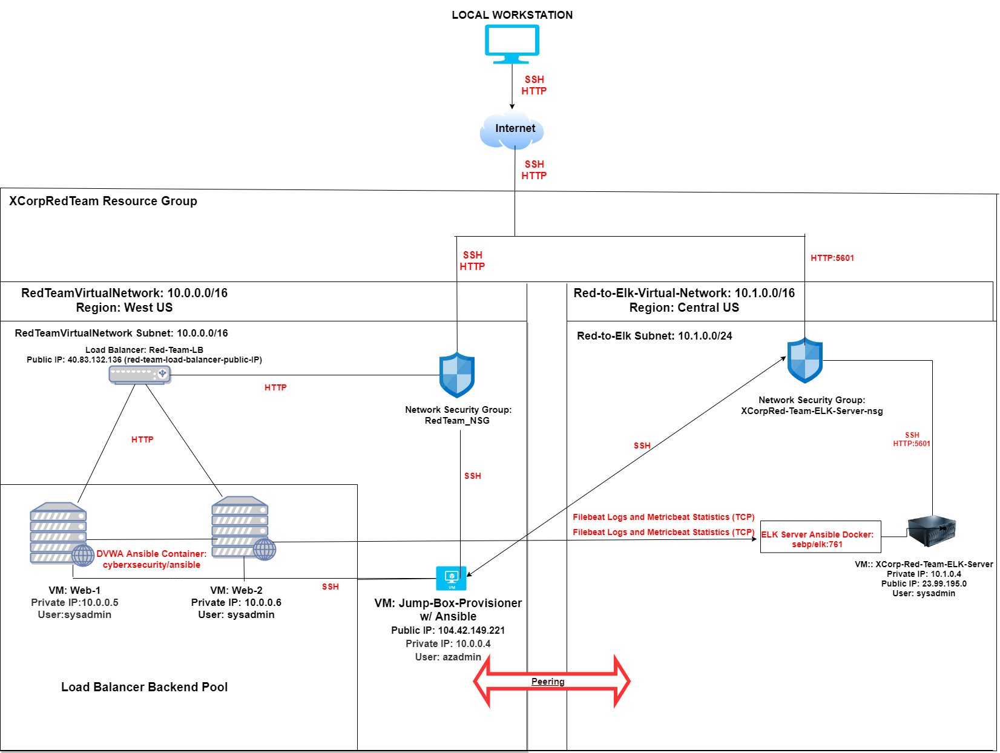

# T_Applewhite_Project_1
The class files of Timothy Applewhite for CyberBootCamp at WUSTL.
## Automated ELK Stack Deployment

The files in this repository were used to configure the network depicted below.

These files have been tested and used to generate a live ELK deployment on Azure. They can be used to either recreate the entire deployment pictured above. Alternatively, select portions of the ansible playbook (.yml) file may be used to install only certain pieces of it, such as Filebeat.

  - _Ansible/pentest.yml.txt_
  - _Ansible/install-elk.yml.txt_
  - _Ansible/filebeat-playbook.yml.txt_
  - _Ansible/metricbeat-playbook.yml.txt_

This document contains the following details:
- Description of the Topology
- Access Policies
- ELK Configuration
  - Beats in Use
  - Machines Being Monitored
- How to Use the Ansible Build

### Description of the Topology

The main purpose of this network is to expose a load-balanced and monitored instance of DVWA, the D*mn Vulnerable Web Application.

Load balancing ensures that the application will be highly available/accessible, in addition to restricting unauthorized access to the network.

_Load Balancers Protect the application's Availability, or the ability to connect to a one of multiple connected webservers in the most efficient manner possible.  The advantage of a jump box lies essentially in the fact that it is the sole connection and access point that can securely connect to the web servers.  Thus, the overall number of vulnerable access points for the entire network security group is minimized, along with the corresponding possible vectors of attack.  Furthermore, any sort of remote connection to the jump box can be more easily documented, intercepted, and mitigated; since Network Security Professionals can direct most of their time and attention to the security of one virtual machine rather than each one individually._

Integrating an ELK server allows users to easily monitor the vulnerable VMs for changes to the settings/configuration and system data.
	- _Filebeat specifically monitors log files (or other specified locations).  Filebeat then aggregates log events and will forward such information for the purpose of indexing to such programs as Elasticsearch or Logstash._
	- _Metricbeat monitors and collects metric data from the OS and services running on specified Servers/Virtual Machines.  It collects this data and forwards it to the specified output of the user, such as Elasticsearch or Logstash._

The configuration details of each machine may be found below.
_Note: Use the [Markdown Table Generator](http://www.tablesgenerator.com/markdown_tables) to add/remove values from the table_.

| Name                    | Function     | IP Address | Operating System          |
|-------------------------|--------------|------------|---------------------------|
| Jump-Box-Provisioner    | Gateway      | 10.0.0.4   | Linux (Ubuntu)            |
| web-1                   | DVWA         | 10.0.0.5   | Linux (Ubuntu)            |
| web-2                   | DVWA         | 10.0.0.6   | Linux (Ubuntu)            |
| XCorpRed-Team-ELK-Server| ELK Server   | 10.1.0.4   | Linux (Ubuntu)            |

### Access Policies

The machines on the internal network are not exposed to the public Internet. 

Only the Jump-Box-Provisioner machine can accept connections from the Internet. Access to this machine is only allowed from the following IP addresses:
- _107.220.192.108/32_

Machines within the network can only be accessed by Jump-Box-Provisioner VM, once the Docker has been sucessfully started and attached.
- _The Jump-Box-Provisioner VM via Docker is able to securely connect via SSH to the ELK Server. The Jump-Box-Provisioner VM's Private IP Address is 10.0.0.4, and its Public IP Address is 104.42.149.221._

A summary of the access policies in place can be found in the table below.

| Name                     | Publicly Accessible | Allowed IP Addresses                                                  |
|--------------------------|---------------------|-----------------------------------------------------------------------|
| Jump-Box-Provisioner     | No                  | (SSH only from Local Host IP 107.220.192.108/32)                      |
| web-1                    | No                  | (HTTP and SSH from Local Host IP, and SSH from Jump-Box 10.0.0.4/32)  |
| web-2                    | No                  | (HTTP and SSH from Local Host IP, and SSH from Jump-Box 10.0.0.4/32)  |
| XCorpRed-Team-ELK-Server | No                  | (SSH from 10.1.0.0/16 and HTTP via LocalHost:Port 5601)               |

### Elk Configuration

Ansible was used to automate configuration of the ELK machine. No configuration was performed manually, which is advantageous because...
- _It allows Network Administrators to implement changes to a large scale for many machines at once with a single process.  It also means that the desired outcome will be completed as quickly as possible from conception to full implementation.  Furthermore, there is the added bonus that these Ansible Playbooks can be saved and tweaked for future use in the compltion of the repetitive tasks necessary to setup and configure a virtual network as efficiently as possible._

The playbook implements the following tasks:
- _Install Docker configured with Python module and download DVWA image, in this case "cyberxsecurity/dvwa"._
- _Add access to Elastic repositories connected to the necessary software required for ELK Stack functionality._
- _Start and Attach previously installed Docker to Jump-Box VM to connect to ELK Server.
- _Edit necessary config files to habe proper credentialing required for the VM's on the network to communicate for ELK Stack._  
- _Run necessary playbooks to install Elasticsearch, Kibana, Logstash, Filebeat, and Metricbeat._

The following screenshot displays the result of running `docker ps` after successfully configuring the ELK instance.

### Target Machines & Beats
This ELK server is configured to monitor the following machines:
[webservers]
	- web-1: Private IP: _10.0.0.5 _
	- web-2: Private IP: _10.0.0.6 _
We have installed the following Beats on these machines:
- Filebeat
- Metricbeat

These Beats allow us to collect the following information from each machine:
- _Filebeat is used to monitor specified log files for real-time events on the target machine for the ELK Server, such as unauthorized SSH attempts on the specified webservers.  Whereas Metricbeat monitors the system's overall metrics like CPU Usage and Memory, or it can be used to collect metric data on the usage of specified services active on the target machine._

### Using the Playbook
In order to use the playbook, you will need to have an Ansible control node already configured. Assuming you have such a control node provisioned: 

SSH into the control node and follow the steps below:
- Copy the _.ssh/id_rsa.pub_ for your Ansible Docker file to the 'Reset Password' section under the Azure Portal Settings of the desired VM as to allow SSH.
- Update the _/etc/ansible/hosts_ file to include the Webservers and ELK Server as hosts, including both their Private IP Address and the necessary Python line to provide the Python Interpreter.  For example:
	-[webservers]
	 10.0.0.5 ansible_python_interpreter=/usr/bin/python3
   10.0.0.6 ansible_python_interpreter=/usr/bin/python3
	-[elk]
	 10.1.0.4 ansible_python_interpreter=/usr/bin/python3
- Run the playbook, and navigate to /etc/ansible/ansible.cfg to check that the installation worked as expected.  
	-Network communcations can be confirmed by running bash command in "ansible all -m ping" in while attached to control node.

_TODO: Answer the following questions to fill in the blanks:_
- _The playbook is a YAML file.  For example, _Ansible/install-elk.yml.txt_ is the playbook for installing the necessary programs for the ELK server to run.  This file must be copied to the Ansible Container that is attached and running on the Jump Box VM._
- _One must update the _/etc/ansible/hosts_ file in order to make Ansible run the playbook on a specific machine. One specifies which machine to install the ELk Server on versus which to install the Filebeat on by first creating separate YAML playbooks for each task; each one either installing ELK or Filebeat.  Then, one must create and edit a separate Filebeat Configuration file within their Ansible Container and save this file to the _/etc/ansible/roles_ Directory, such as _Ansible/filebeat-config.yml.txt_.  Editing this Configuration file specifies via Private IP which VM will have Filebeat installed on it.  Specifically by naming the host of the output for Elasticsearch, the host machine's corresponding Elasticsearch credentials (under output.elasticsearch), and the specified host for interfacing with Kibana (under setup.kibana). All of this taking place, of course, assuming one has already edited their _/etc/ansible/hosts_ file to reflect their desired groupings of VM's between Webservers and ELK._
- _One should then navigate to _http://[ELK.VM.Public.IP]:5601/app/kibana_ to verify that their ELK Server is receiving Metricbeat and Logbeat data displayed on their Kibana Interface._

**Bonus**

The specific commands a user will need to run and download the playbook, update the files, and run the playbooks to install ELK, Filebeat, and Metricbeat are as follows:

	SSH to your Jump Box VM with ssh azadmin@Jump-Box-Provisioner-IP

	Start and Attach Ansible Container with _sudo docker start <docker-name>_ followed by _sudo docker attach <docker-name>_

	Navigate to _/etc/ansible_ and configure _/etc/ansible/hosts_ to reflect Webservers and ELK hosts with _nano /etc/ansible/hosts_.

	Edit _/etc/ansible/ansible.cfg_ file to ensure Python interpreter with nano /etc/ansible/ansible.cfg

	Run the necessary Playbooks:

	ansible-playbook /etc/ansible/pentest.yml
	
	ansible-playbook /etc/ansible/install-elk.yml

	nano /etc/ansible/roles/filebeat-config.yml

	ansible-playbook /etc/ansible/roles/filebeat-playbook.yml

	nano /etc/ansible/metricbeat-config.yml

	ansible-playbook /etc/ansible/metricbeat-playbook.yml

If no errors are observed in the output of the above playbooks, then navigate to http://[ELK.VM.PUBLIC.IP]:5601/app/kibana_ to review beat data recorded by ELK Server deployment.
